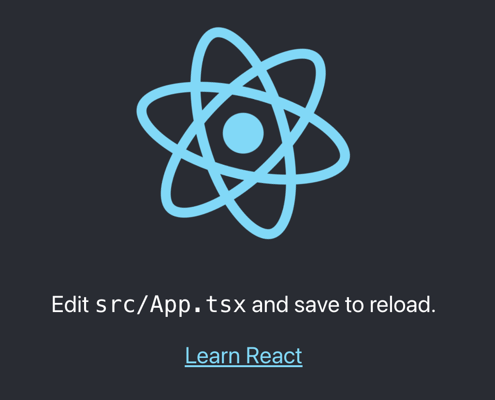

# hello-modular


Run [modular](https://github.com/jpmorganchase/modular) in Kubernetes.


## Requirements


## Steps

1. `docker build -t hello-modular .`
2. `docker tag hello-modular $USERNAME/hello-modular:v1`
3. `docker push $USERNAME/hello-modular:v1`
4. `kind create cluster`
5. `helm install modular ./helm`
```
❯ k get pods --all-namespaces
NAMESPACE            NAME                                         READY   STATUS    RESTARTS   AGE
default              helm-hello-modular-6dc46df6d6-4tjsv          1/1     Running   0          29s
```

```
hello-modular on  master [!?] via ⬢ v14.15.4 took 8s
❯ k logs helm-hello-modular-6dc46df6d6-4tjsv
10.244.0.1 - - [18/Jan/2021:21:13:10 +0000] "GET / HTTP/1.1" 200 612 "-" "kube-probe/1.19" "-"
10.244.0.1 - - [18/Jan/2021:21:13:12 +0000] "GET / HTTP/1.1" 200 612 "-" "kube-probe/1.19" "-"
10.244.0.1 - - [18/Jan/2021:21:13:20 +0000] "GET / HTTP/1.1" 200 612 "-" "kube-probe/1.19" "-"
10.244.0.1 - - [18/Jan/2021:21:13:22 +0000] "GET / HTTP/1.1" 200 612 "-" "kube-probe/1.19" "-"
10.244.0.1 - - [18/Jan/2021:21:13:30 +0000] "GET / HTTP/1.1" 200 612 "-" "kube-probe/1.19" "-"
```

Now lets test it out...


